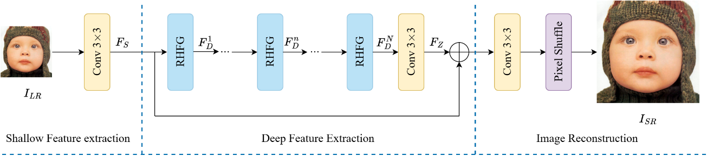

### 📖 Enhancing Image Super-Resolution with Channel-Spatial Fusion Modulation

---
<p align="center">
  
</p>

*An overview of the proposed CSFMN. CSFMN first transforms the input LR image into the feature space using a convolutional layer, performs feature extraction using a series of residual hybrid feature groups (RHFGs), and then reconstructs these extracted features by an upsampler module. The RHFG block is mainly implemented by a feature fusion module (FFM) layer, convolution layer and residual connection. The FFM block is mainly implemented by a channel-spatial fusion modulation (CSFM) layer and a convolutional channel mixer (CCM).*

---
### Requirements
> - Python 3.8, PyTorch >= 1.11
> - BasicSR 1.4.2
> - Platforms: Ubuntu 18.04, cuda-11

### Installation
```
# Clone the repo

# Install dependent packages
cd CSFMN
pip install -r requirements.txt
# Install BasicSR
python setup.py develop
```
You can also refer to this [INSTALL.md](https://github.com/XPixelGroup/BasicSR/blob/master/docs/INSTALL.md) for installation

### Training
Run the following commands for training:
```
# train CSFMN for x4 effieicnt SR
python basicsr/train.py -opt options/train/CSFMN/train_DIV2K_X4.yml
```
### Testing 
- Download the pretrained models.
- Download the testing dataset.
- Run the following commands:
```
# test CSFMN for x4 efficient SR
python basicsr/test.py -opt options/test/CSFMN/test_benchmark_x4.yml
```
- The test results will be in './results'.

### Results
- **Pretrained models and visual results**

  We have provided three ways to download our checkpoints.
    -  1.Download via the Google Drive links shown below.

### Citation
If this work is helpful for your research, please consider citing the following BibTeX entry.
```
@inproceedings{
 }
 ```


### Acknowledgement
This code is based on [BasicSR](https://github.com/XPixelGroup/BasicSR) toolbox. Thanks for the awesome work.

### Contact
If you have any questions, please feel free to reach me out at luow0522@163.com

